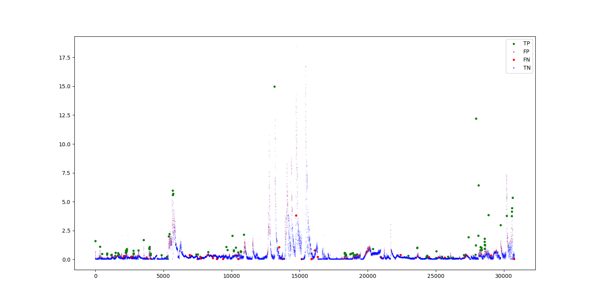

# Homework-2---Overlapping-Sliding-Windows-Anomaly-Detection
In this assignment you will detect anomalies in a Nitrate time series using a threshold-based method with fixed-size, overlapping sliding windows (step size = 1). You will compute a q-percentile threshold within each window and classify the newly added data point as normal or anomaly. Ground truth indicates there are 77 anomaly events in total.

#Figure highlighting detected anomalies (e.g., scatter/line plot with anomalies marked)

#Chosen W and q with rationale (brief)
q is the around the value needed in order to have an above 80% accuracy for the 
w helped in balancing

#Normal accuracy and Anomaly accuracy (with TP, FP, FN, TN counts)

#Any design choices (one-sided vs two-sided threshold, handling of NaNs, etc.)
One sided was chosen 

